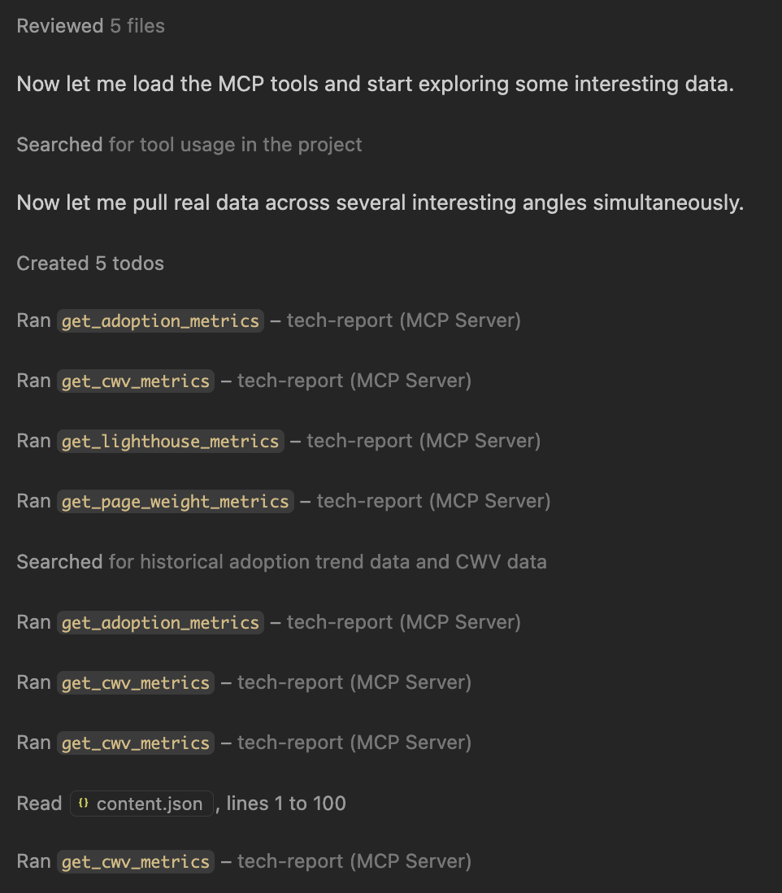

# Asking AI About the Web: HTTP Archive Tech Report via MCP

The [HTTP Archive](https://httparchive.org/) has tracked the state of the web since 2010 — crawling millions of pages monthly and measuring adoption, performance, and page weight across millions of origins. The [Tech Report](https://httparchive.org/reports/techreport) already makes those insights available as an interactive web UI: pick any technology, explore Core Web Vitals, Lighthouse scores, trends over time, geo breakdowns.

The [Model Context Protocol](https://modelcontextprotocol.io/) server brings that same dataset to AI agents. Instead of navigating the web UI, you describe what you want to compare and your agent fetches and reasons over the numbers directly. It's public, free, and requires no authentication — the same data, just a different interface.

## Setup

Point your AI tool at the public MCP endpoint — no API key or account needed. For Github Copilot in VS Code, add this to `.vscode/mcp.json`:

```json
{
  "servers": {
    "tech-report": {
      "type": "http",
      "url": "https://cdn.httparchive.org/mcp"
    }
  }
}
```

Other MCP-compatible clients (Cursor, Claude Desktop, Windsurf) use similar configuration — check your client's MCP setup docs. Then ask anything. The same data you'd explore at [httparchive.org/reports/techreport](https://httparchive.org/reports/techreport) is now available to your agent.

---


## Where this gets interesting for data people

The MCP exposes the same dimensions the web UI does — adoption, CWV distributions, Lighthouse scores, page weight, geographic breakdowns, version tracking — queryable by technology name, date range, client, and rank segment. The difference is composability: you can layer them in a single prompt and let the agent draw connections across metrics.

The most useful pattern is ad-hoc combinations the web UI doesn't expose as a preset: mix any technologies you care about with any metrics, date ranges, geos, and rank segments in a single prompt. You can also move between levels — ask about a category (e.g. "JavaScript frameworks") to orient, then drill into individual technologies to compare. Rank segments (`top 1000` vs `all`) layered over a CWV trend, for example, reveal whether performance patterns hold across the full long tail or only at scale.

The data is already public at [httparchive.org/reports/techreport](https://httparchive.org/reports/techreport). MCP is just another way in.

**Available tools:** `get_adoption_metrics`, `get_cwv_metrics`, `get_lighthouse_metrics`, `get_page_weight_metrics`, `get_cwv_distribution`, `get_geo_breakdown`, `get_audits_metrics`, `list_versions`, `search_technologies`, `list_categories`, `list_ranks`, `list_geos`

---

## Examples

Here are a few things that came out of asking it questions.

:::{.callout-note}
Prompts and responses below are lightly edited for clarity and formatting, but otherwise verbatim from Copilot.
:::

{.lightbox fig-alt="Screenshot of a GitHub Copilot chat session querying HTTP Archive Tech Report data via MCP" width="60%"}

### Scale vs. quality: the CMS paradox

> *"Compare adoption and Core Web Vitals for the CMS category. Then break it down by the top platforms — WordPress, Shopify, Wix, Squarespace — on mobile."*

Starting at the category level surfaces the overall picture: CMS sites underperform the web average on mobile CWV. Drilling into individual platforms explains why — scale is unevenly distributed.

WordPress runs on roughly 7× more origins than Shopify — but only half of those sites pass Core Web Vitals on mobile. Wix and Shopify, both fully-managed platforms with no plugin ecosystem to bloat, both clear the ~79% mark.

| Platform | Mobile origins | Mobile CWV (good) |
|---|---|---|
| WordPress | 3,046,471 | 48.1% |
| Shopify | 417,517 | 78.9% |
| Wix | 199,249 | **79.7%** |
| Squarespace | 101,708 | 70.8% |

The pattern holds for e-commerce too: Shopify leads Magento and WooCommerce on both Lighthouse performance (0.47 vs 0.34) and accessibility (0.905 vs 0.80). Managed infrastructure has real, measurable advantages — the data makes that case plainly.

---

### Meta-frameworks underperform their base libraries

> *"What are the most popular JavaScript frameworks? Now compare mobile CWV pass rates for React, Vue.js, Next.js, Nuxt.js, and Angular."*

Starting with the category gives a ranked list to orient from. Then asking for CWV across base libraries and their meta-framework counterparts in one pass surfaces a consistent pattern:


```
JavaScript frameworks: mobile CWV pass rate (Feb 2026)
             0%                   50%
          ├────────────────────┤
React      ██████████████████░░  46.0%   base library
Vue.js     ████████████████░░░░  38.9%   base library
     ╌╌╌╌╌╌╌╌╌╌╌╌╌╌╌╌╌╌╌╌╌╌╌╌╌╌
Next.js    ████████████░░░░░░░░  30.9%   ↑ builds on React  −15 pts
Nuxt.js    ███████████░░░░░░░░░  28.1%   ↑ builds on Vue    −11 pts
Angular    ███████░░░░░░░░░░░░░  17.0%   ◀ outlier
```

Next.js trails React by 15 points despite being built on it. Nuxt.js similarly lags Vue.js. The abstraction layer adds real overhead — or at least, common usage patterns in those meta-frameworks do. Angular is a notable outlier: only 17% of Angular sites pass mobile CWV overall.

---

### Astro is the fastest-growing framework by far

> *"Show the adoption trend for Next.js, Astro, SvelteKit, and Nuxt.js on desktop from Jan 2024 to Feb 2026. Also pull median page weight for each."*

Mixing a date range, a specific client, and a second metric in one prompt — the kind of combination that would require several separate views in the web UI.

```
Adoption growth Jan 2024 → Feb 2026
          0%                             +400%
          ├──────────────────────────────────┤
Astro      ████████████████████████████████  +371%
SvelteKit  ████████████░░░░░░░░░░░░░░░░░░░  +141%
Next.js    █████████░░░░░░░░░░░░░░░░░░░░░░  +100%
Nuxt.js    ████░░░░░░░░░░░░░░░░░░░░░░░░░░░   +44%
```

Astro grew 371% in 25 months. Next.js doubled in absolute numbers and still leads by adoption count (204K desktop origins). Adding page weight in the same query surfaces the trade-off: frameworks with the fastest growth ship very different amounts of JavaScript.

```
Median JS shipped, mobile
          0 KB                           1,100 KB
          ├──────────────────────────────────┤
SvelteKit  ████████████████░░░░░░░░░░░░░░░    476 KB  ◀ least JS
Astro      ███████████████████░░░░░░░░░░░░    565 KB
Next.js    ██████████████████████████████░    890 KB
Nuxt.js    ████████████████████████████████ 1,065 KB
```

SvelteKit ships the least JavaScript of the four — its compiler approach pays off on page weight. Astro is lighter overall despite more JS, likely because its islands architecture avoids loading unused components.

---

## Try it for your stack

The examples above reflect the most popular questions we see people explore in UI — CMS quality gaps, framework overhead, growth trajectories. Your questions will be different.

If you work with a specific platform, framework, or geography, the same tools apply. Ask about your own stack, your competitors, or the category you operate in. The data covers millions of origins across years of crawls.

The MCP server is open source. If there's a dimension you want exposed that isn't there yet — a new metric, a filter, a different aggregation — the handler may be extended: [HTTPArchive/tech-report-apis](https://github.com/HTTPArchive/tech-report-apis/blob/main/src/mcpHandler.js).
